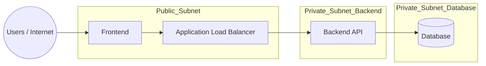

# terraform-3tier-architecture
Infrastructure-as-Code project using Terraform to deploy a 3-tier architecture (frontend, backend, database) on AWS.
## Table of Contents
- [Overview](#overview)
- [Architecture](#architecture)
- [Prerequisites](#prerequisites)
- [Project Structure](#project-structure)
- [Usage](#usage)
- [Outputs](#outputs)
- [Best Practices](#best-practices)
- [License](#license)
## Overview
This project demonstrates how to use Terraform to provision a secure and scalable 3-tier architecture. 
It includes:
- VPC and networking
- Frontend web servers
- Backend application servers
- Database tier (RDS)
  
## Architecture


## Prerequisites
- Terraform v1.x
- AWS CLI configured with credentials
- An AWS account
## Usage
1. Initialize Terraform:
   terraform init

2. Preview changes:
   terraform plan

3. Apply configuration:
   terraform apply

4. Destroy resources:
   terraform destroy

## Outputs
- Load Balancer DNS
- Database Endpoint
- EC2 Public ip

## Best Practices
- Use remote state (S3 + DynamoDB) for collaboration
- Store secrets in AWS Secrets Manager
- Apply least-privilege IAM roles


    BE --> DB
```
## Networking Connection
Internet
   │
Internet Gateway
   │
Public Route Table
   │
 ┌───────────────┬───────────────┐
 │               │
Subnet1          Subnet2
(Public)         (Public)
│
NAT Gateway
│
Private Route Table
│
 ┌───────────────┬───────────────┐
 │               │
Subnet3          Subnet4
(Private)        (Private)
