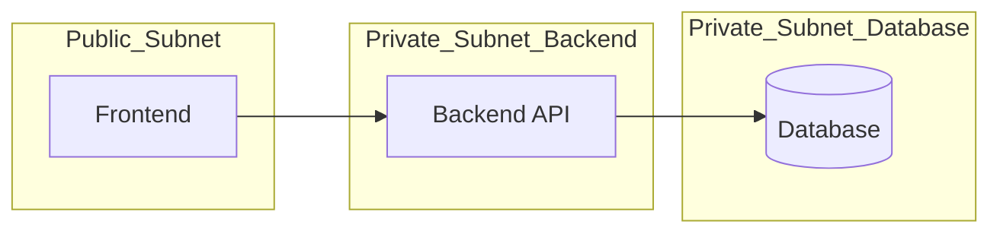

# terraform-3tier-architecture
Infrastructure-as-Code project using Terraform to deploy a 3-tier architecture (frontend, backend, database) on AWS.
## Table of Contents
- [Overview](#overview)
- [Architecture](#architecture)
- [Prerequisites](#prerequisites)
- [Project Structure](#project-structure)
- [Usage](#usage)
- [Outputs](#outputs)
- [Best Practices](#best-practices)
- [License](#license)
## Overview
This project demonstrates how to use Terraform to provision a secure and scalable 3-tier architecture. 
It includes:
- VPC and networking
- Frontend web servers
- Backend application servers
- Database tier (RDS)

